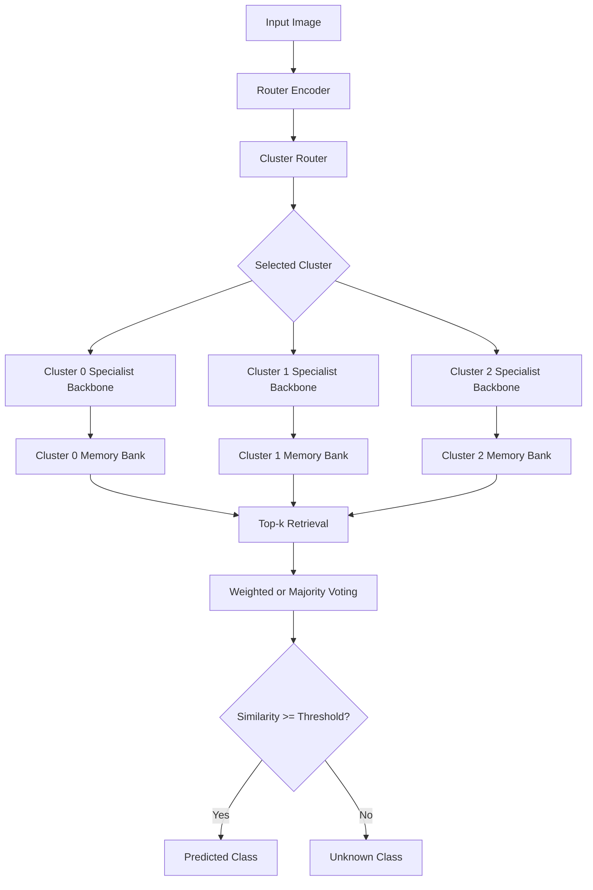
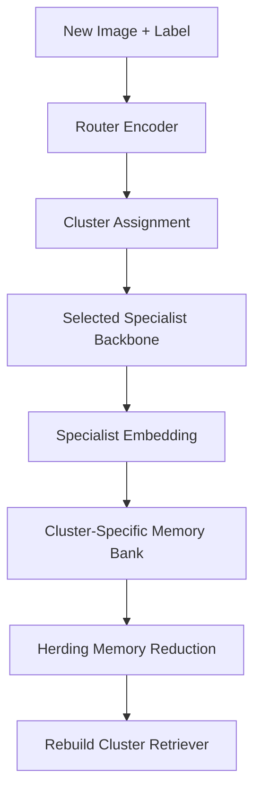
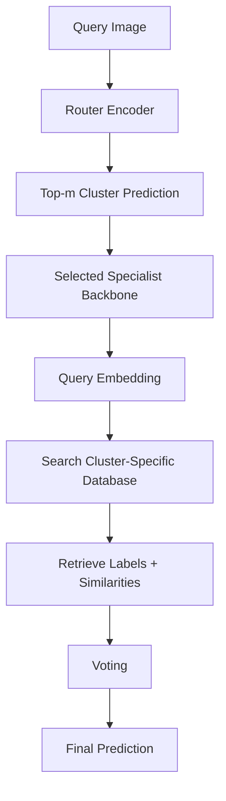

# CRISP 2.0: Continual Retrieval & Indexing System for Perception

**CRISP 2.0** is a cluster-aware incremental image classification library. It uses a router encoder, a clustering module, specialist backbones, cluster-specific vector databases, and herding-based memory reduction.

Repository:

```text
https://github.com/Hokimastah/CRISP
```

## Why CRISP 2.0?

CRISP 1.0 uses one frozen encoder and one global memory bank. This is stable, but it has two limitations:

1. It works best on relatively generic image data because one frozen backbone may not represent every domain well.
2. It can require large memory because all embeddings are stored.

CRISP 2.0 addresses this with:

```text
Cluster-aware routing
+ specialist backbone per cluster
+ cluster-specific vector database
+ herding memory management
+ retrieval-based weighted voting
```

## Architecture

```text
Input Image
  -> Router Encoder
  -> Cluster Router
  -> Specialist Backbone for Selected Cluster
  -> L2-Normalized Embedding
  -> Cluster-Specific Memory Bank
  -> Herding Memory Reduction
  -> Cluster-Specific Retrieval
  -> Weighted / Majority Voting
  -> Prediction
```

## Components

### Encoders

- `resnet18`
- `resnet34`
- `resnet50`
- `resnet101`
- `resnet152`
- `clip`

### Cluster methods

- `kmeans`
- `minibatch_kmeans`

### Retrievers

- `numpy`
- `annoy`
- `faiss`

### Memory policies

- `herding`
- `none`

## Installation

Install from GitHub:

```bash
pip install git+https://github.com/Hokimastah/CRISP.git
```

Install all optional backends:

```bash
pip install "crisp-perception[all] @ git+https://github.com/Hokimastah/CRISP.git"
```

Install locally:

```bash
git clone https://github.com/Hokimastah/CRISP.git
cd CRISP
pip install -e .
```

Install optional dependencies:

```bash
pip install -e ".[annoy]"
pip install -e ".[faiss]"
pip install -e ".[clip]"
pip install -e ".[all]"
```

If `faiss-cpu` fails on Windows, use Conda:

```bash
conda install -c pytorch faiss-cpu
```

## Dataset Format

```text
dataset/
├── class_a/
│   ├── image_001.jpg
│   └── image_002.jpg
├── class_b/
│   ├── image_003.jpg
│   └── image_004.jpg
└── class_c/
    └── image_005.jpg
```

Folder names become class labels.

## Quick Start

```python
from crisp import ClusteredCRISPClassifier

clf = ClusteredCRISPClassifier(
    router_encoder="resnet18",
    cluster_method="minibatch_kmeans",
    n_clusters=3,
    cluster_top_m=1,
    specialist_backbones={
        0: "resnet18",
        1: "resnet50",
        2: "resnet50"
    },
    retriever="numpy",
    voting="weighted",
    max_exemplars_per_class=50,
    device="cuda"
)

clf.add_folder("dataset")
clf.save("crisp_v2_state.pkl")

result = clf.predict("test_image.jpg")
print(result["predicted_label"])
print(result["scores"])
```

## Incremental Learning

```python
clf.add_folder("task_1_dataset")
clf.save("task_1_state.pkl")

clf.add_folder("task_2_dataset")
clf.save("task_2_state.pkl")
```

The process:

```text
New labeled image
  -> Router encoder
  -> Cluster assignment
  -> Specialist encoder
  -> Embedding extraction
  -> Cluster-specific memory bank
  -> Herding if memory exceeds n
  -> Rebuild cluster retriever
```

## Herding

CRISP 2.0 uses class-balanced herding inside each cluster. If `max_exemplars_per_class = 50`, each class in each cluster stores at most 50 representative embeddings.

Herding rule:

```text
1. Compute class prototype.
2. Compute similarity between each exemplar and the prototype.
3. Keep top-n most representative exemplars.
4. Remove the rest.
```

## Top-m Cluster Routing

```python
clf = ClusteredCRISPClassifier(
    n_clusters=5,
    cluster_top_m=2
)
```

With `cluster_top_m=2`, CRISP searches the two nearest clusters and combines retrieval results. This reduces routing-error risk.

## Unknown Class Detection

```python
result = clf.predict("test_image.jpg", threshold=0.65)
print(result["status"])
print(result["predicted_label"])
print(result["best_similarity"])
```

## CLI Usage

Index dataset:

```bash
crisp index-v2 --data dataset --output crisp_v2_state.pkl --router-encoder resnet18 --n-clusters 3 --retriever numpy --max-exemplars-per-class 50
```

Predict:

```bash
crisp predict-v2 --image test_image.jpg --state crisp_v2_state.pkl --router-encoder resnet18 --n-clusters 3 --retriever numpy --top-k 5
```

Predict with threshold:

```bash
crisp predict-v2 --image test_image.jpg --state crisp_v2_state.pkl --router-encoder resnet18 --n-clusters 3 --retriever numpy --top-k 5 --threshold 0.65
```

## Flowcharts

### Complete Flow



### Ingestion Flow



### Inference Flow



## Python API

```python
ClusteredCRISPClassifier(
    router_encoder="resnet18",
    cluster_method="minibatch_kmeans",
    n_clusters=3,
    cluster_top_m=1,
    specialist_backbones=None,
    specialist_encoder_kwargs=None,
    retriever="numpy",
    retriever_kwargs=None,
    voting="weighted",
    top_k=5,
    max_exemplars_per_class=50,
    memory_policy="herding",
    device=None
)
```

Main methods:

```python
clf.add_folder("dataset")
clf.add_image("image.jpg", label="class_name")
clf.predict("test_image.jpg")
clf.save("crisp_v2_state.pkl")
clf.load("crisp_v2_state.pkl")
clf.summary()
```

## Project Structure

```text
CRISP/
├── pyproject.toml
├── README.md
├── docs/
├── examples/
├── tests/
└── src/
    └── crisp/
        ├── __init__.py
        ├── clustered_classifier.py
        ├── classifier.py
        ├── cli.py
        ├── memory.py
        ├── router.py
        ├── voting.py
        ├── utils.py
        ├── encoders/
        ├── retrievers/
        └── memory_policies/
```

## Limitations

- The router must be fitted before prediction.
- Wrong cluster assignment can reduce prediction quality.
- `cluster_top_m > 1` improves robustness but increases inference cost.
- Too small `max_exemplars_per_class` can reduce accuracy.
- If the encoder configuration changes, rebuild the memory bank.
- FAISS, Annoy, and CLIP require optional dependencies.

## Citation

```bibtex
@software{crisp2026,
  title = {CRISP 2.0: Continual Retrieval & Indexing System for Perception},
  author = {Hokimastah},
  year = {2026},
  url = {https://github.com/Hokimastah/CRISP}
}
```

## License

MIT License.
