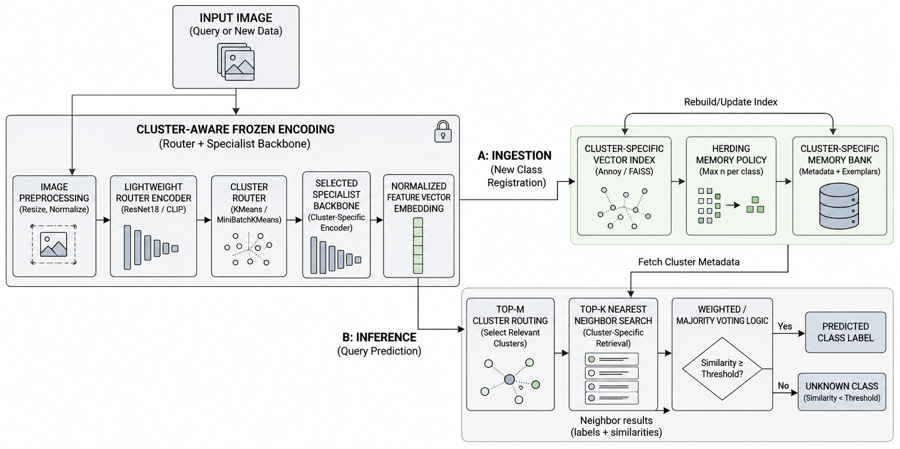
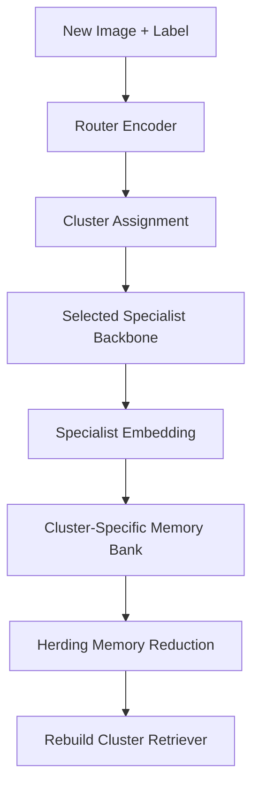
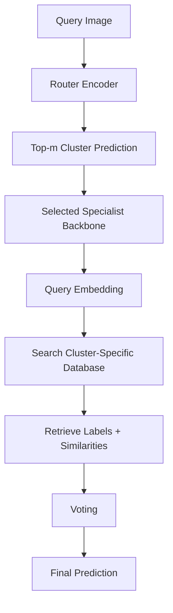

<p align="center">
  
</p>

<h1 align="center">
  🧊 CRISP-v2
</h1>

<h3 align="center">
  Continual Retrieval & Indexing System for Perception v2<br>
  <em>Cluster-Aware Retrieval, Specialist Backbones, and Herding Memory</em>
</h3>

<p align="center">
  <strong>A modular, cluster-aware, RAG-style incremental image classification system.</strong><br>
</p>

CRISP-v2 is an upgraded version of CRISP for **incremental image classification**. It is designed to reduce two major limitations of CRISP v1: dependence on a single generic encoder and unbounded memory growth.

Instead of storing all image embeddings in one global memory bank, CRISP-v2 introduces a **cluster-aware routing mechanism**. Each image is first routed into a visual cluster, then processed by a **cluster-specific specialist backbone**, and finally stored in a **cluster-specific vector database**. To prevent memory usage from growing indefinitely, CRISP-v2 uses **herding-based memory reduction**, keeping only the most representative samples up to a maximum of `n` exemplars per class.

Repository:

```text
https://github.com/Hokimastah/CRISP-v2.git
```

---

## 1. Update Notes: What is New in CRISP-v2?

CRISP v1 introduced a simple retrieval-based incremental classification pipeline:

```text
Image
→ Frozen Encoder
→ Embedding
→ Global Memory Bank
→ Top-k Retrieval
→ Voting
→ Predicted Class
```

CRISP-v2 extends this design into a more scalable and domain-aware architecture:

```text
Image
→ Router Encoder
→ Cluster Router
→ Specialist Backbone
→ Cluster-Specific Memory Bank
→ Herding Memory Reduction
→ Cluster-Specific Retrieval
→ Voting
→ Predicted Class
```

### Main Updates

| Update | Description |
|---|---|
| Cluster-aware routing | Images are routed into visual clusters before specialist feature extraction |
| Router encoder | A lightweight encoder extracts routing features for clustering |
| Cluster router | Uses `KMeans` or `MiniBatchKMeans` to assign images to clusters |
| Specialist backbone per cluster | Each cluster can use a different encoder/backbone |
| Cluster-specific memory bank | Each cluster has its own vector database |
| Cluster-specific retriever | Retrieval is performed only inside selected cluster memory |
| Herding memory policy | Keeps only representative exemplars to reduce memory size |
| Maximum exemplar budget | Limits stored samples using `max_exemplars_per_class = n` |
| Top-m cluster routing | Allows inference over more than one cluster to reduce routing errors |
| CRISP-v1 compatibility | CRISP-v2 can still keep the original `CRISPClassifier` style if implemented alongside `ClusteredCRISPClassifier` |

---

## 2. Why CRISP-v2?

CRISP v1 is stable and simple, but it has two important limitations:

### 2.1 Single Generic Encoder Limitation

CRISP v1 uses one frozen encoder for all data. This works well for generic image data, but it may be less effective for specific visual domains such as:

- medical images,
- plant disease images,
- industrial defect images,
- satellite images,
- microscopic images,
- domain-specific object datasets.

A single generic backbone may not extract equally strong features for all domains.

### 2.2 Large Memory Bank Limitation

CRISP v1 stores embeddings in one memory bank. If more samples and classes are added over time, memory usage increases continuously.

This can lead to:

- larger storage requirement,
- slower retrieval,
- higher RAM usage,
- less efficient indexing,
- increasingly expensive inference.

CRISP-v2 addresses these issues by using **cluster-specific memory banks** and **herding-based memory reduction**.

---

## 3. CRISP-v1 vs CRISP-v2

| Aspect | CRISP v1 | CRISP-v2 |
|---|---|---|
| Main architecture | Single global retrieval classifier | Cluster-aware retrieval classifier |
| Encoder design | One frozen encoder | Router encoder + specialist backbones |
| Memory bank | One global memory bank | One memory bank per cluster |
| Retrieval scope | Search all stored embeddings | Search selected cluster database |
| Domain adaptability | Limited for non-generic domains | Better through cluster-specific specialists |
| Memory growth | Can grow indefinitely | Controlled with herding |
| Memory policy | Add-only memory | Herding with maximum exemplar budget |
| Scalability | Good for small-medium datasets | Better for larger or multi-domain datasets |
| Routing mechanism | None | KMeans / MiniBatchKMeans |
| Inference robustness | Single global retrieval | Top-m cluster routing available |
| Complexity | Lower | Higher |
| Main class | `CRISPClassifier` | `ClusteredCRISPClassifier` |

---

## 4. Main Idea

CRISP-v2 follows this principle:

```text
Input Image
→ Router Encoder
→ Cluster Router
→ Selected Cluster
→ Specialist Backbone
→ Cluster-Specific Embedding
→ Cluster-Specific Vector Index
→ Top-k Retrieval
→ Voting
→ Predicted Class
```

The model still avoids catastrophic forgetting because the visual encoders are **frozen**. New data are added by extracting embeddings and updating memory banks, not by retraining the backbone.

The main difference is that CRISP-v2 does not put all embeddings into one global database. Instead, it separates them by cluster and applies a memory policy.

---

## 5. Key Features

- Frozen encoder for stable feature extraction
- Router encoder for cluster assignment
- KMeans and MiniBatchKMeans routing
- Specialist backbone per cluster
- Cluster-specific memory bank
- Cluster-specific retriever
- Retrieval-based classification
- Weighted voting and majority voting
- Top-m cluster routing
- Herding-based memory reduction
- Maximum exemplar budget per class
- Optional unknown-class detection using similarity threshold
- Modular encoder backend
- Modular retrieval backend
- CLI support for indexing and prediction
- Installable as a Python library

---

## 6. Supported Components

### 6.1 Router and Specialist Encoders

| Encoder | Description |
|---|---|
| `resnet18` | Frozen ResNet18 feature extractor |
| `resnet34` | Frozen ResNet34 feature extractor |
| `resnet50` | Frozen ResNet50 feature extractor |
| `resnet101` | Frozen ResNet101 feature extractor |
| `resnet152` | Frozen ResNet152 feature extractor |
| `clip` | Frozen CLIP image encoder using `open_clip_torch` |

### 6.2 Cluster Routers

| Router | Description |
|---|---|
| `kmeans` | Standard KMeans clustering |
| `minibatch_kmeans` | MiniBatchKMeans for larger datasets |

Recommended default:

```text
minibatch_kmeans
```

### 6.3 Retrieval Backends

| Retriever | Description |
|---|---|
| `numpy` | Exact brute-force cosine retrieval using NumPy |
| `annoy` | Approximate nearest neighbor retrieval using Annoy |
| `faiss` | Similarity search using FAISS `IndexFlatIP` |

### 6.4 Voting Methods

| Voting | Description |
|---|---|
| `weighted` | Class score is calculated from the sum of similarity values |
| `majority` | Class score is calculated from the number of retrieved neighbors |

For most experiments, `weighted` voting is recommended because it considers both label frequency and similarity strength.

### 6.5 Memory Policies

| Memory Policy | Description |
|---|---|
| `herding` | Keeps the most representative exemplars per class |
| `none` | Keeps all embeddings without memory reduction |

---

## 7. Installation

### 7.1 Install from GitHub

```bash
pip install git+https://github.com/Hokimastah/CRISP-v2.git
```

### 7.2 Install from GitHub with All Optional Backends

```bash
pip install "crisp-perception[all] @ git+https://github.com/Hokimastah/CRISP-v2.git"
```

If your `pyproject.toml` uses the package name `crisp`, use:

```bash
pip install "crisp[all] @ git+https://github.com/Hokimastah/CRISP-v2.git"
```

### 7.3 Install Locally for Development

```bash
git clone https://github.com/Hokimastah/CRISP-v2.git
cd CRISP-v2
pip install -e .
```

### 7.4 Install with Optional Dependencies

Install Annoy support:

```bash
pip install -e ".[annoy]"
```

Install FAISS support:

```bash
pip install -e ".[faiss]"
```

Install CLIP support:

```bash
pip install -e ".[clip]"
```

Install all optional dependencies:

```bash
pip install -e ".[all]"
```

### 7.5 FAISS Installation Note

If `faiss-cpu` cannot be installed through `pip`, especially on some Windows environments, use Conda:

```bash
conda install -c pytorch faiss-cpu
```

---

## 8. Dataset Format

CRISP-v2 expects a folder-based image classification dataset.

```text
dataset/
├── class_a/
│   ├── image_001.jpg
│   ├── image_002.jpg
│   └── image_003.jpg
├── class_b/
│   ├── image_004.jpg
│   ├── image_005.jpg
│   └── image_006.jpg
└── class_c/
    ├── image_007.jpg
    └── image_008.jpg
```

The folder name is automatically used as the class label.

Example:

```text
dataset/cat/cat_001.jpg → label = cat
dataset/dog/dog_001.jpg → label = dog
```

Supported image formats:

```text
.jpg, .jpeg, .png, .bmp, .webp, .tif, .tiff
```

---

## 9. Basic Usage

### 9.1 Clustered CRISP-v2 with ResNet Router and Specialist Backbones

```python
from crisp import ClusteredCRISPClassifier

clf = ClusteredCRISPClassifier(
    router_encoder="resnet18",
    cluster_method="minibatch_kmeans",
    n_clusters=3,
    cluster_top_m=1,
    specialist_backbones={
        0: "resnet18",
        1: "resnet50",
        2: "resnet50"
    },
    retriever="numpy",
    voting="weighted",
    top_k=5,
    max_exemplars_per_class=50,
    memory_policy="herding",
    device="cuda"
)

clf.add_folder("dataset")
clf.save("crisp_v2_state.pkl")

result = clf.predict("test_image.jpg")

print(result["status"])
print(result["predicted_label"])
print(result["scores"])
print(result["best_similarity"])
```

### 9.2 CPU Usage

```python
from crisp import ClusteredCRISPClassifier

clf = ClusteredCRISPClassifier(
    router_encoder="resnet18",
    cluster_method="minibatch_kmeans",
    n_clusters=3,
    retriever="numpy",
    device="cpu",
    max_exemplars_per_class=30
)

clf.add_folder("dataset")
result = clf.predict("test_image.jpg")

print(result)
```

---

## 10. Incremental Learning Usage

CRISP-v2 supports incremental updates by adding new labeled data into clustered memory.

```python
from crisp import ClusteredCRISPClassifier

clf = ClusteredCRISPClassifier(
    router_encoder="resnet18",
    cluster_method="minibatch_kmeans",
    n_clusters=5,
    cluster_top_m=1,
    retriever="numpy",
    voting="weighted",
    max_exemplars_per_class=50,
    memory_policy="herding",
    device="cuda"
)

# Initial data
clf.add_folder("dataset_task_1")
clf.save("state_task_1.pkl")

# Add new data or new classes
clf.add_folder("dataset_task_2")
clf.save("state_task_2.pkl")

# Predict using the updated clustered memory
result = clf.predict("test_image.jpg")
print(result["predicted_label"])
```

The flow is:

```text
New image + label
→ router encoder
→ cluster assignment
→ selected specialist backbone
→ specialist embedding
→ append to cluster-specific memory bank
→ apply herding if memory exceeds n
→ rebuild cluster-specific retriever
```

No backbone retraining is performed.

---

## 11. Using Different Retrieval Backends

### 11.1 NumPy Retriever

The NumPy backend performs exact brute-force retrieval. It is suitable for smaller memory banks or baseline experiments.

```python
clf = ClusteredCRISPClassifier(
    router_encoder="resnet18",
    n_clusters=3,
    retriever="numpy",
    device="cuda"
)
```

### 11.2 Annoy Retriever

Annoy is useful for approximate nearest neighbor search when cluster-specific memory banks become larger.

```python
clf = ClusteredCRISPClassifier(
    router_encoder="resnet18",
    n_clusters=3,
    retriever="annoy",
    retriever_kwargs={
        "n_trees": 20,
        "metric": "angular"
    },
    device="cuda",
    top_k=10
)
```

### 11.3 FAISS Retriever

FAISS is useful for faster dense vector similarity search.

```python
clf = ClusteredCRISPClassifier(
    router_encoder="resnet18",
    n_clusters=3,
    retriever="faiss",
    device="cuda",
    top_k=10
)
```

---

## 12. Using CLIP Encoder

CLIP can be used as a router encoder or specialist encoder when the dataset contains semantically diverse visual classes.

Install CLIP support:

```bash
pip install -e ".[clip]"
```

### 12.1 CLIP as Router Encoder

```python
from crisp import ClusteredCRISPClassifier

clf = ClusteredCRISPClassifier(
    router_encoder="clip",
    cluster_method="minibatch_kmeans",
    n_clusters=5,
    specialist_backbones={
        0: "resnet18",
        1: "resnet50",
        2: "resnet50",
        3: "resnet101",
        4: "resnet50"
    },
    retriever="numpy",
    device="cuda",
    max_exemplars_per_class=50
)

clf.add_folder("dataset")
result = clf.predict("test_image.jpg")

print(result["predicted_label"])
```

### 12.2 CLIP as Specialist Backbone

```python
from crisp import ClusteredCRISPClassifier

clf = ClusteredCRISPClassifier(
    router_encoder="resnet18",
    cluster_method="minibatch_kmeans",
    n_clusters=3,
    specialist_backbones={
        0: "resnet50",
        1: "clip",
        2: "resnet50"
    },
    specialist_encoder_kwargs={
        1: {
            "model_name": "ViT-B-32",
            "pretrained": "laion2b_s34b_b79k"
        }
    },
    retriever="faiss",
    device="cuda",
    max_exemplars_per_class=50
)

clf.add_folder("dataset")
result = clf.predict("test_image.jpg")

print(result)
```

---

## 13. Herding Memory Reduction

CRISP-v2 uses herding to control memory size.

If:

```python
max_exemplars_per_class = 50
```

then each class inside each cluster stores at most 50 representative exemplars.

### 13.1 Herding Logic

For each class in each cluster:

```text
1. Collect all embeddings from the class.
2. Compute class prototype.
3. Measure cosine similarity between each embedding and the prototype.
4. Keep top-n most representative samples.
5. Remove the remaining samples.
```

Class prototype:

```text
prototype_c = mean(embedding_1, embedding_2, ..., embedding_m)
```

Selection score:

```text
score(x_i) = cosine_similarity(x_i, prototype_c)
```

CRISP-v2 keeps the top `n` samples with the highest score.

### 13.2 Why Herding?

Herding reduces memory usage while preserving representative samples.

Without herding:

```text
all embeddings are stored
```

With herding:

```text
only the most representative n exemplars are stored per class
```

---

## 14. Top-m Cluster Routing

Routing errors can happen when a query image is assigned to the wrong cluster. To reduce this risk, CRISP-v2 supports top-m cluster routing.

If:

```python
cluster_top_m = 1
```

CRISP-v2 searches only the nearest cluster.

If:

```python
cluster_top_m = 2
```

CRISP-v2 searches the two nearest clusters, merges the retrieved neighbors, then performs voting.

Example:

```python
result = clf.predict(
    "test_image.jpg",
    cluster_top_m=2
)
```

Top-m routing is useful when cluster boundaries overlap or when the router confidence is low.

---

## 15. Unknown Class Detection

CRISP-v2 can mark a query image as unknown if the best similarity score is below a threshold.

```python
result = clf.predict(
    "test_image.jpg",
    threshold=0.65
)

print(result["status"])
print(result["predicted_label"])
print(result["best_similarity"])
```

Possible output:

```python
{
    "status": "unknown",
    "predicted_label": None,
    "best_similarity": 0.42
}
```

For cosine similarity, a higher value means the query is more similar to retrieved samples.

---

## 16. Command Line Interface

CRISP-v2 provides a CLI command named `crisp`.

### 16.1 Build CRISP-v2 State

```bash
crisp index-v2 \
  --data dataset \
  --output crisp_v2_state.pkl \
  --router-encoder resnet18 \
  --cluster-method minibatch_kmeans \
  --n-clusters 3 \
  --cluster-top-m 1 \
  --retriever numpy \
  --max-exemplars-per-class 50 \
  --memory-policy herding
```

### 16.2 Predict Image

```bash
crisp predict-v2 \
  --image test_image.jpg \
  --state crisp_v2_state.pkl \
  --router-encoder resnet18 \
  --cluster-method minibatch_kmeans \
  --n-clusters 3 \
  --cluster-top-m 1 \
  --retriever numpy \
  --top-k 5
```

### 16.3 Predict with Threshold

```bash
crisp predict-v2 \
  --image test_image.jpg \
  --state crisp_v2_state.pkl \
  --router-encoder resnet18 \
  --cluster-method minibatch_kmeans \
  --n-clusters 3 \
  --retriever numpy \
  --top-k 5 \
  --threshold 0.65
```

### 16.4 CLI with Annoy

```bash
crisp index-v2 \
  --data dataset \
  --output crisp_v2_state.pkl \
  --router-encoder resnet18 \
  --n-clusters 3 \
  --retriever annoy \
  --max-exemplars-per-class 50

crisp predict-v2 \
  --image test_image.jpg \
  --state crisp_v2_state.pkl \
  --router-encoder resnet18 \
  --n-clusters 3 \
  --retriever annoy \
  --top-k 10
```

### 16.5 CLI with FAISS

```bash
crisp index-v2 \
  --data dataset \
  --output crisp_v2_state.pkl \
  --router-encoder resnet18 \
  --n-clusters 3 \
  --retriever faiss \
  --max-exemplars-per-class 50

crisp predict-v2 \
  --image test_image.jpg \
  --state crisp_v2_state.pkl \
  --router-encoder resnet18 \
  --n-clusters 3 \
  --retriever faiss \
  --top-k 10
```

---

## 17. System Flowchart



### 17.1 Complete CRISP-v2 Flow


### 17.2 Ingestion Flow



### 17.3 Inference Flow



---

## 18. How CRISP-v2 Works

### 18.1 Router Feature Extraction

The query or new image is first passed into a router encoder.

```text
image → router encoder → router embedding
```

The router embedding is used only for cluster assignment.

### 18.2 Cluster Assignment

The cluster router assigns the image to the nearest cluster.

```text
router embedding → cluster_id
```

Supported cluster routers:

```text
kmeans
minibatch_kmeans
```

### 18.3 Specialist Feature Extraction

After the cluster is selected, CRISP-v2 uses the specialist backbone assigned to that cluster.

```text
image → specialist backbone of selected cluster → specialist embedding
```

### 18.4 L2 Normalization

The embedding is normalized:

```text
embedding = embedding / ||embedding||
```

This makes dot product equivalent to cosine similarity when using normalized vectors.

### 18.5 Cluster-Specific Memory Bank

Each cluster has its own memory bank.

```text
cluster_0 → memory_bank_0
cluster_1 → memory_bank_1
cluster_2 → memory_bank_2
```

Each stored sample contains:

```python
{
    "embedding": vector,
    "label": "class_name",
    "metadata": {
        "path": "dataset/class_name/image.jpg",
        "cluster_id": 0,
        "router_encoder": "resnet18",
        "specialist_backbone": "resnet50"
    }
}
```

### 18.6 Retrieval

During inference, CRISP-v2 searches the most similar embeddings only from selected cluster memory.

```text
query embedding → selected cluster database → top-k nearest neighbors
```

If `cluster_top_m > 1`, the system searches multiple clusters and merges the results.

### 18.7 Voting

For weighted voting:

```text
Score(class) = sum(similarity of neighbors from that class)
```

For majority voting:

```text
Score(class) = number of retrieved neighbors from that class
```

The class with the highest score becomes the prediction.

---

## 19. Recommended Experimental Variants

| Variant | Router Encoder | Specialist Backbone | Retriever | Memory Policy |
|---|---|---|---|---|
| CRISP-v2-R18-R50-Numpy | ResNet18 | ResNet50 | NumPy | Herding |
| CRISP-v2-R18-R50-Annoy | ResNet18 | ResNet50 | Annoy | Herding |
| CRISP-v2-R18-R50-FAISS | ResNet18 | ResNet50 | FAISS | Herding |
| CRISP-v2-CLIP-R50-Numpy | CLIP | ResNet50 | NumPy | Herding |
| CRISP-v2-R18-CLIP-FAISS | ResNet18 | CLIP | FAISS | Herding |
| CRISP-v2-TopM2 | ResNet18 | ResNet50 | FAISS | Herding + top-m routing |
| CRISP-v2-NoHerding | ResNet18 | ResNet50 | NumPy | None |

---

## 20. Suggested Evaluation Metrics

For image classification experiments:

- Accuracy
- Precision
- Recall
- F1-score
- Confusion matrix

For retrieval experiments:

- Top-k retrieval accuracy
- Mean similarity score
- Retrieval latency
- Average number of searched vectors

For incremental learning experiments:

- Average accuracy across tasks
- Forgetting score
- Backward transfer
- Forward transfer
- Per-task accuracy

For memory efficiency experiments:

- Number of stored exemplars
- Memory size before herding
- Memory size after herding
- Compression ratio
- Accuracy-memory trade-off

---

## 21. Project Structure

```text
CRISP-v2/
├── pyproject.toml
├── README.md
├── LICENSE
├── docs/
│   └── architecture_v2.md
├── examples/
│   ├── basic_v2_usage.py
│   └── top_m_routing.py
├── tests/
│   ├── test_herding.py
│   ├── test_memory.py
│   └── test_voting.py
└── src/
    └── crisp/
        ├── __init__.py
        ├── classifier.py
        ├── clustered_classifier.py
        ├── cli.py
        ├── memory.py
        ├── router.py
        ├── utils.py
        ├── voting.py
        ├── encoders/
        │   ├── __init__.py
        │   ├── base.py
        │   ├── factory.py
        │   ├── resnet.py
        │   └── clip_encoder.py
        ├── retrievers/
        │   ├── __init__.py
        │   ├── base.py
        │   ├── factory.py
        │   ├── numpy_backend.py
        │   ├── annoy_backend.py
        │   └── faiss_backend.py
        └── memory_policies/
            ├── __init__.py
            └── herding.py
```

---

## 22. API Reference

### 22.1 `ClusteredCRISPClassifier`

```python
ClusteredCRISPClassifier(
    router_encoder="resnet18",
    cluster_method="minibatch_kmeans",
    n_clusters=3,
    cluster_top_m=1,
    specialist_backbones=None,
    specialist_encoder_kwargs=None,
    retriever="numpy",
    retriever_kwargs=None,
    voting="weighted",
    top_k=5,
    max_exemplars_per_class=50,
    memory_policy="herding",
    device=None,
    pretrained=True,
    router_kwargs=None
)
```

### Parameters

| Parameter | Description |
|---|---|
| `router_encoder` | Encoder used to extract routing embeddings |
| `cluster_method` | `kmeans` or `minibatch_kmeans` |
| `n_clusters` | Number of visual clusters |
| `cluster_top_m` | Number of clusters searched during inference |
| `specialist_backbones` | Dictionary mapping cluster IDs to backbone names |
| `specialist_encoder_kwargs` | Additional kwargs for specialist encoders |
| `retriever` | Retrieval backend: `numpy`, `annoy`, or `faiss` |
| `retriever_kwargs` | Additional kwargs for retriever backend |
| `voting` | `weighted` or `majority` |
| `top_k` | Number of nearest neighbors used for voting |
| `max_exemplars_per_class` | Maximum number of exemplars stored per class per cluster |
| `memory_policy` | `herding` or `none` |
| `device` | `cuda`, `cpu`, or `None` |
| `pretrained` | Whether to use pretrained ResNet weights |
| `router_kwargs` | Additional settings for router encoder and cluster model |

### 22.2 Main Methods

```python
clf.add_image(image_path, label)
```

Add one labeled image to the clustered memory system.

```python
clf.add_folder(folder)
```

Add a folder dataset to clustered memory.

```python
clf.predict(image_path, top_k=None, threshold=None, cluster_top_m=None)
```

Predict the class of a query image.

```python
clf.save(path)
```

Save CRISP-v2 state to a `.pkl` file.

```python
clf.load(path)
```

Load CRISP-v2 state from a `.pkl` file.

```python
clf.summary()
```

Return cluster memory sizes and configuration summary.

---

## 23. Output Format

Example prediction output:

```python
{
    "status": "known",
    "predicted_label": "cat",
    "scores": {
        "cat": 2.72,
        "dog": 1.11
    },
    "best_similarity": 0.91,
    "selected_clusters": [
        {
            "cluster_id": 0,
            "distance": 0.32,
            "router_score": 0.75
        }
    ],
    "neighbors": [
        {
            "index": 0,
            "label": "cat",
            "similarity": 0.91,
            "cluster_id": 0,
            "router_score": 0.75,
            "metadata": {
                "path": "dataset/cat/cat_001.jpg",
                "cluster_id": 0
            }
        }
    ],
    "router_encoder": "resnet18",
    "retriever": "numpy"
}
```

---

## 24. Notes and Limitations

- CRISP-v2 does not fine-tune backbones during incremental updates.
- The router must be fitted before prediction.
- The same router encoder and specialist configuration should be used when saving and loading states.
- If encoder configuration changes, the clustered memory should be rebuilt.
- `n_clusters` must be tuned empirically.
- Very small datasets may not benefit from clustering.
- Routing errors may reduce performance if `cluster_top_m = 1`.
- `cluster_top_m > 1` can improve robustness but increases inference cost.
- Herding reduces memory usage, but an overly small `max_exemplars_per_class` can reduce accuracy.
- The threshold for unknown-class detection must be tuned empirically for each dataset.
- The first use of pretrained ResNet may download model weights automatically.
- FAISS and CLIP require optional dependencies.

---

## 25. Migration from CRISP v1

If you used CRISP v1:

```python
from crisp import CRISPClassifier

clf = CRISPClassifier(
    encoder="resnet50",
    retriever="numpy"
)
```

In CRISP-v2, use:

```python
from crisp import ClusteredCRISPClassifier

clf = ClusteredCRISPClassifier(
    router_encoder="resnet18",
    n_clusters=3,
    retriever="numpy",
    max_exemplars_per_class=50
)
```

### Conceptual migration

```text
CRISPClassifier
→ ClusteredCRISPClassifier

encoder
→ router_encoder + specialist_backbones

global memory_bank
→ cluster-specific memory_banks

add-only memory
→ add-only memory + herding policy
```

---

## 26. License

This project is released under the MIT License.

---

## 27. Citation

If you use CRISP-v2 in an academic project, you can cite this repository as:

```bibtex
@software{crispv2_2026,
  title = {CRISP-v2: Cluster-Aware Continual Retrieval & Indexing System for Perception},
  author = {Satrio Puji Danuirto},
  year = {2026},
  url = {https://github.com/Hokimastah/CRISP-v2}
}
```
